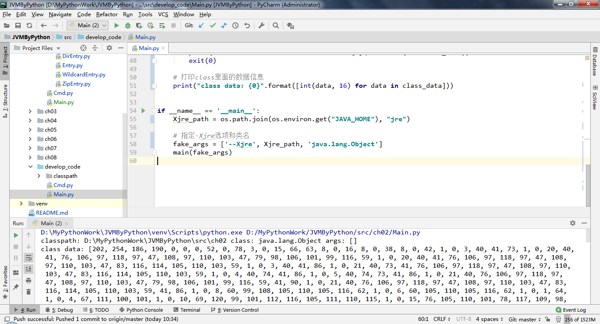

# 记录自己用Python完成编写JVM的过程

项目完全参考张秀宏大神的《自己动手写Java虚拟机》代码结构，在此向本书作者表示感谢。

## 运行环境 ##
Python 版本：3.7.2  
PyCharm 版本：PyCharm 2018.3.7 (Professional Edition)

## 代码结构 ##

## 代码编写与运行结果 ##
项目的所有运行都是采用Run的方式传参，并执行，请读者运行时注意

### 第一章-命令行工具 ###
完成一个简易的命令行工具，使用各种参数执行JVM命令  
传入参数：
> --cp foo/bar MyApp arg1 arg2

采用OptionParser作为命令行解析器，具体处理的打印输入留给Cmd类去处理。

### 第二章-搜索class文件 ###
完成搜索class文件功能，类路径的查找，按照搜索的先后顺序，类路径可以从以下3个部分查找：启动类路径、扩展类路径、用户类路径。
传入参数：
> --Xjre "D:\JavaTools\jdk1.8.0_151\jre" java.lang.Object

1. pathListSeparator引用路径写死为分号“;”，Linux下面为冒号。
2. 由于class是Python的关键字，所有代码中的class改为了className。
3. 如果该结构体是数组，由于Python无法表示结构数组，故类初始化的时候初始一个数组。